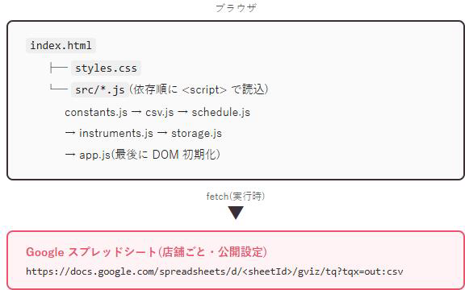
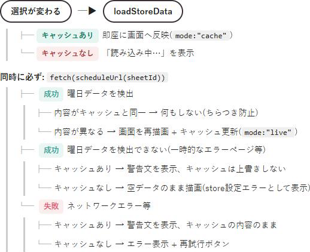

# あぽろん レッスン日程 — 仕様書

対象読者: このリポジトリを保守・改修する開発者。初めてこのコードに触る方でも、この1本を読めば全体の動きと勘所がつかめることを目指しています。
非エンジニア向けの説明資料は別途 `docs/あぽろんレッスン日程_取扱説明書.pptx` を参照してください。あちらは「何ができるアプリか」を伝えるための資料で、こちらは「どう作られているか」を伝えるための資料、と役割を分けています。
`README.md` は開発環境のセットアップ・実行手順が中心です。本書はそれよりもう一段階踏み込んで、アプリの内部仕様(データフロー・モジュールごとの役割・状態管理・制約とその理由)を、背景も含めてまとめたものです。

最終更新: 2026-08-23 / 対象バージョン: `VERSION` ファイルによる自動採番(執筆時点 16)

## 1. 概要

生徒・保護者・教員が、あぽろんミュージックスクール各教室のレッスン日程を確認するための非公式 Web アプリです。教室 → 曜日 → 先生の3ステップを選ぶだけで、次のレッスン日がひと目でわかる、という単純な体験を目指して作られています。

このアプリを理解するうえで、まず押さえておきたい前提が3つあります。

- **ビルド不要・フレームワーク不要の素の HTML / CSS / JavaScript(ES5 相当)で書かれています。** React や Vue のようなライブラリは使っていません。npm install も webpack もなく、ファイルをそのままブラウザで読み込めば動きます。これは、特別な開発環境を用意しなくても誰でもすぐ手を入れられるようにするための、意図的なシンプルさです。
- **専用バックエンドを持ちません。** データベースもAPIサーバーも存在せず、Google スプレッドシートから、ブラウザ(クライアント側)が毎回直接データを取得しています。つまり「アプリのサーバー」という概念自体がありません。
- **静的ファイルのみで完結するため、任意の静的ホスティング(GitHub Pages 等)で配信できます。** サーバーサイドの処理が一切走らないので、ファイルを置くだけでどこでも動きます。

## 2. アーキテクチャ

まず全体の姿を図で示します。ブラウザが `index.html` を読み込むと、そこから `styles.css` と `src/` 配下の JavaScript ファイルが順番に読み込まれ、最後に画面が組み立てられます。データはその都度 Google スプレッドシートに取りに行きます。



図の下半分にある「fetch(実行時)」という矢印がポイントです。ビルド時にデータを埋め込んでいるわけではなく、ユーザーがアプリを開いたその瞬間に、ブラウザが直接スプレッドシートへ問い合わせに行きます。サーバーサイドの処理・データベース・認証は存在しません。すべての計算はブラウザの中だけで完結します。

### レイヤー構成

`src/` 配下の各ファイルは、それぞれ役割がはっきり分かれています。上から下に向かって「DOM や通信に依存しない、テストしやすい純粋な部品」から「実際に画面を操作する部品」へと積み上がっていくイメージです。

| ファイル | 役割 | DOM/通信への依存 |
|---|---|---|
| `src/constants.js` | 店舗一覧・曜日順・localStorage キー名の一元管理 | なし |
| `src/csv.js` | RFC4180 相当の CSV パーサー(引用符内改行・カンマ・エスケープ対応) | なし(純粋関数) |
| `src/schedule.js` | CSV 行列 → スケジュールデータへの変換・日付解決 | なし(純粋関数) |
| `src/instruments.js` | 教科名 → 楽器アイコン(絵文字)の対応表 | なし(純粋関数) |
| `src/storage.js` | `localStorage` の読み書き(try/catch でラップ) | `localStorage` のみ |
| `src/app.js` | DOM 生成・イベント処理・`fetch` 呼び出し・状態管理 | DOM + `fetch` + 上記全モジュール |

上の4つ(`constants.js` 〜 `instruments.js`)は「純粋関数」と書きましたが、これは「同じ入力を渡せば必ず同じ結果が返ってきて、画面やネットワークには一切触らない」という意味です。だからこそテストが書きやすく、実際に `test/tests.js` で自動テストされています(10章参照)。一方 `app.js` だけは例外で、画面の描画やボタンのクリック処理、通信の呼び出しをすべて担当する「まとめ役」です。

これらのファイルは `AMS` というグローバルな名前空間(`this.AMS = this.AMS || {}`)の下に、それぞれ `AMS.constants` / `AMS.csv` / `AMS.schedule` / `AMS.instruments` / `AMS.storage` / `AMS.app` としてぶら下がる形で公開されています。いわゆる IIFE(即時実行関数)+ 名前空間パターンで、モダンな `import` / `export` は使っていません。`type="module"` も使用していません。これは 3 章で説明する `test/run.ps1` が cscript という ES3 相当のエンジンで直接 JavaScript を実行しているためで、モジュール構文がそもそも動かない環境を想定しているからです。

## 3. 実行環境の制約(ES3 相当への配慮)

このプロジェクトのテスト(`test/run.ps1`)は、Node.js を一切使わず、Windows に標準で入っている `cscript.exe`(JScript / ES3 エンジン)でそのまま JavaScript を実行する、という少し変わった仕組みになっています。これは「テストのためだけに Node.js をインストールしてもらう」というハードルをなくし、Windows さえあれば誰でもすぐテストを実行できるようにするための工夫です。

そのぶん、`src/csv.js` `src/schedule.js` `src/instruments.js` `src/constants.js` の4ファイルは、**意図的に古い ES3 相当の構文で書かれています。** 普段 ES6 以降の書き方に慣れていると少し窮屈に感じるかもしれませんが、理由があってのことなので、以下のルールを守ってください。

- `var` のみを使用します(`let` / `const` は使いません)。
- 配列やオブジェクトの末尾カンマを禁止しています。テストランナーが正規表現でカンマを取り除く処理をしており、末尾カンマがあると構文が壊れてしまうためです。
- アロー関数・テンプレートリテラル・`Array.prototype.includes` など、ES6 以降に追加された構文や API は使いません。
- 絵文字を扱う箇所(`src/instruments.js`)では、`String.fromCharCode` によってサロゲートペアを手動で組み立てています。読みやすい `String.fromCodePoint` は ES3 に存在しないため、あえて使っていません。
- ソースコードの中で `"//"` という文字の並びを作らないようにしています。`test/run.ps1` はコメントを取り除くために `(?m)//[^\r\n]*` という正規表現を使っており、URL の `https://` のような文字列までコメントだと誤認して消してしまうためです。そのため `scheduleUrl` の中では URL 文字列を `'https:' + '/' + '/...'` のようにわざと分割して書いています。少し不格好に見えますが、これも壊さないための工夫です。

**もしこの制約を知らずに `src/` 配下(4ファイル)へ新しいコードを追加すると、`test/run.ps1` によるテストが実行時エラーで落ちてしまいます。** 逆に言うと、テストが落ちたときにまずこの章を疑ってもらえば、原因の見当がつきやすいはずです。なお `src/app.js` は DOM 層であり自動テストの対象外なので、この制約そのものは適用されません。ただし、将来的にコードのスタイルがバラバラにならないよう、`app.js` でも同じ書き方を踏襲しています。

## 4. データモデル

### 4.1 店舗定義 (`AMS.constants.STORES`)

各店舗の情報は、次のような形のオブジェクトの配列として `src/constants.js` にまとめられています。

```js
{
  id: string,        // 内部識別子。localStorage キーにも使う
  name: string,       // 表示名(例: "新潟店")
  sheetId: string,    // Google スプレッドシートの ID
  sitePath: string,   // 公式サイト内のパス
  siteUrl: string,    // 実行時に SITE_BASE + sitePath で自動生成
}
```

現在は7店舗(新潟店 / 新潟東区役所店 / 新潟駅南店 / イオン新潟西店 / イオンモール新発田店 / 長岡店 / 三条店)が登録されています。**新しく店舗を追加・変更したい場合は、`src/constants.js` の `STORES` 配列に1件追加するだけで済むように設計されています。** ただし、対象のスプレッドシートの列構成が、次の4.2で説明する形式ときちんと一致している必要があります。ここがズレていると、追加したのに日程が表示されない、という状態になってしまうので注意してください。

### 4.2 スプレッドシートの想定フォーマット

このアプリは、各店舗のスプレッドシートが次のような共通フォーマットで作られていることを前提にしています。シートのどこかに見出し行があり、A列が `"曜日"` という文字で始まる行を、アプリ側が自動的に見出し行として検出します。

| 列 | 内容 |
|---|---|
| A | 曜日(結合セル相当。同じ曜日が続く間は2行目以降が空欄になっている想定) |
| B | 講師名(複数行になっている場合はスペース区切りで1つに連結される) |
| C | 月1のレッスン日(カンマ区切り。`※` で始まる行は日付ではなく注記として別扱いされる) |
| D | 月2のレッスン日(Cと同じルール) |
| E | 教科(楽器名を含む文字列。複数ある場合は改行で区切る) |

補足として、以下の2点も覚えておくと役立ちます。

- レッスンの時間帯を表す列はフォーマット上そもそも存在しません。そのためアプリ側でも時間の情報は一切扱っていません。
- シートの更新日は、冒頭6行以内を走査して `YYYY/M/D 更新` というパターンを正規表現で探し出す形で抽出しています(`extractUpdatedAt` 関数、`src/schedule.js`)。この6行という範囲は「更新日はだいたいシートの最初のほうに書かれている」という前提に基づく制限なので、もし更新日の位置が大きく変わった場合はこの数字も見直す必要があります。

### 4.3 パース後のスケジュール行 (`AMS.schedule.parseSchedule` の戻り値)

CSV を読み込んで解析すると、最終的に次のような形のオブジェクトになります。この形さえ理解しておけば、`app.js` 側で画面にどう表示されているかも追いやすくなります。

```js
{
  updatedAt: string,       // "2026/8/12" のような文字列。抽出できなければ ""
  monthLabels: [string, string],  // 例: ["8月", "9月"]
  rows: [
    {
      weekday: string,       // "月" など(前方補完済み)
      teacher: string,       // 講師名(生の値。表示直前まで整形しない)
      subjects: string[],    // 教科名の配列
      months: [
        { dateItems: string[], notes: string[] },  // 月1
        { dateItems: string[], notes: string[] },  // 月2
      ],
    },
    // ...
  ],
}
```

### 4.4 日付解決 (`AMS.schedule.resolveLessonDates`)

スプレッドシートに書かれている `"10"` や `"17(A)"`、`"9/6"` といった文字列(`dateItems`)は、そのままでは「今日から何日後か」を計算できません。そこでこの関数が、それぞれを実際の `Date` オブジェクトに変換し、当日を基準にした状態(過去・今日・次回・未来など)を付与しています。

- **年の推定**: 対象の月と `today` の月の差が ±6 を超える場合は、年をまたいでいるとみなします。たとえば12月に「1月」という列を見つけたときは、来年の1月として扱う、という具合です。
- **存在しない日付への対応**: たとえば `2/30` のような、実際には存在しない日付を `new Date()` にそのまま渡すと、JavaScript は自動的に3月2日のような別の日付へ繰り上げて解釈してしまいます。これを誤判定として扱わないために、あらかじめ `day > daysInMonth(year, month)` で弾いて `null` を返すようにしています。
- **「次回」の判定**: 全日付の中から「今日以降でいちばん近い1件」だけに `status: 'next'`(当日ちょうどなら `'today'`)というマークと、`daysUntil`(今日から何日後か)を付与します。それ以外の日付は `'past'`(過去)・`'future'`(未来だが次回ではない)・(日付として読み取れなかった場合は)`'unknown'` のいずれかになります。

### 4.5 localStorage スキーマ (`AMS.storage`, キー定義は `AMS.constants.STORAGE_KEYS`)

このアプリが端末(ブラウザ)に保存している情報は、次の3種類だけです。

| キー | 内容 | 形式 |
|---|---|---|
| `ams-schedule:last-selection` | 前回選択した `{storeId, weekday, teacher}` | JSON文字列 |
| `ams-schedule:cache:<storeId>` | 店舗ごとの直近取得 CSV `{csvText, fetchedAt}` | JSON文字列 |
| `ams-schedule:theme` | `"light"` \| `"dark"` | 文字列 |

これらはいずれも `try/catch` でラップされており、`localStorage` が使えない環境(プライベートブラウジング等)であっても、例外を投げて画面を壊すことはありません。読み込みは黙って `null` を返し、書き込みも黙って諦める、という安全側に倒した設計にしています。なお、氏名や連絡先といった個人情報は、この3つのどこにも保存対象として含まれていません。

## 5. データ取得フロー (`loadStoreData`, `src/app.js`)

教室を選んだときに何が起きているかを、少し丁寧に追ってみます。ポイントは「キャッシュがあれば、まずそれを即座に見せる」という体感速度優先の作りになっていることです。



流れを言葉で説明すると、こうなります。まず、その店舗を前に選んだことがあってキャッシュが残っていれば、通信を待たずにそれをすぐ画面に出します。それと並行して、必ず裏側で最新のデータを取りに行き(`fetch(scheduleUrl(sheetId))`)、結果が返ってきたときに初めて「内容が変わっていたかどうか」を確認します。変わっていなければ何もしない(せっかく表示されている画面がちらついたりスクロール位置がずれたりしないように)、変わっていれば静かに描画し直す、という挙動です。通信が失敗したりデータが読み取れなかったりした場合も、キャッシュさえあれば「前回の内容」を出し続けるので、電波の悪い場所でもアプリが真っ白になることは基本的にありません。

もうひとつ大事な工夫として、`state.storeId` の変更を都度チェックしている点があります(`if (state.storeId !== storeId) return;`)。これは、`fetch` の応答が返ってくる前にユーザーが別の店舗を選び直してしまった場合に、古い店舗の結果を新しい画面に誤って反映しないためのガードです。いわゆる競合状態(レースコンディション)対策です。

## 6. 状態管理 (`src/app.js`)

このアプリの DOM 層は、グローバルな `state` というオブジェクト1つだけで状態を管理しています。Redux のような専用の状態管理ライブラリは使っていません。規模が小さいアプリなので、これくらいシンプルな作りで十分、という判断です。

```js
state = {
  storeId: string|null,
  weekday: string|null,
  teacher: string|null,
  data: ParsedSchedule|null,  // 4.3 の parseSchedule 戻り値
}
```

ユーザーが教室・曜日・先生のいずれかを選び直すたびに、`persistSelection()` が呼ばれて `localStorage` に反映されます。次にアプリを開いたときは、初期化処理(`restoreSelection`)がこの保存内容を読み込み、対応するデータを取得したあとで、曜日と先生の選択を自動的に復元しようと試みます。もし以前選んでいた曜日や先生がスプレッドシート側でなくなっていた場合は、静かにリセットされる仕組みになっています。

## 7. UI 描画方針

- DOM の生成は、`document.createElement` と `textContent` の組み合わせだけで行っています(`el()` というヘルパー関数、`src/app.js` 参照)。**`innerHTML` はこのアプリの中で一切使用していません。** これは意図的な設計です。スプレッドシートの内容は、いわば「外部の、誰かが書き込める可能性のあるデータソース」であり、それをそのまま画面に出す構成である以上、`innerHTML` を使ってしまうと理論上 XSS(スクリプト注入)のリスクが生まれてしまいます。`textContent` しか使わないことで、そのリスクを構造的にゼロにしています。今後この部分を触る場合も、この方針は必ず維持してください。
- 教室・曜日・先生の3つのチップ一覧は、見た目も挙動もほぼ同じなので、`renderChipList()` という共通関数でまとめて描画しています。呼び出し側は「今どれが選択されているか」の判定・表示するラベル・クリックされたときの処理、この3つだけを差し替えれば済むようになっています。
- ライト表示とダーク表示の切り替えは、`document.documentElement` に付いている `data-theme` 属性で行っています。実際の色は `styles.css` 側の CSS カスタムプロパティ(`:root` / `prefers-color-scheme: dark` / `[data-theme="dark"]`)で出し分けています。ユーザーが自分でボタンを押して明示的に切り替えた場合だけ `localStorage` に保存し、まだ何も選んでいない状態では、端末(OS)の設定である `prefers-color-scheme` にそのまま従います。
- フッターにある「紹介QR」ボタン(`#qr-btn`)は、仕組みとしてはとてもシンプルです。`#qr-modal` という要素は常に DOM 上に存在していて、`hidden` 属性を付けたり外したりするだけで表示・非表示を切り替えています。表示される QR 画像は `icons/qr-share.png` という、アプリの公開 URL を指す静的な画像ファイルで、あらかじめ生成して埋め込んであるものです。クライアント側で QR コードをその都度生成するような処理は持っていません。閉じる操作は「✕ ボタンを押す」「背景(バックドロップ)部分をクリックする」「Esc キーを押す」の3通りに対応しています。ひとつ実装上の注意点として、`.qr-modal` には `display: flex` を指定しているため、何もしないと `[hidden]` 属性が効かなくなってしまいます(ブラウザ標準の `[hidden] { display: none; }` というスタイルより、こちらの指定の方が優先されてしまうためです)。そのため `.qr-modal[hidden] { display: none; }` という一行を明示的に用意して、上書きされないようにしています。これは CSS の `hidden` 属性まわりでよく起きがちな落とし穴なので、同じパターンで新しいモーダルを作る際は覚えておくと良いです。

## 8. 対応環境・非対応環境

- **対応環境**: `fetch` / `Promise` / `localStorage` / `matchMedia` / `requestAnimationFrame` が実装されているモダンなブラウザ(Safari, Chrome, Edge 等)であれば動作します。前提として JavaScript が有効になっている必要があります。
- **file:// で直接開くと動作しません**: `index.html` をダブルクリックして `file://` から直接開こうとすると、`docs.google.com` への `fetch` が CORS ポリシーによってブラウザ側で拒否されてしまい、データが取得できません。必ず `http(s)://` 経由(開発中は `serve.ps1` によるローカル配信、公開時は GitHub Pages 等の静的ホスティング)で開く必要があります。
- レスポンシブ対応はしていますが、基本的にはスマートフォンでの利用を優先したデザインになっています(`.page { max-width: 520px }`)。PC の大きな画面で見ても崩れませんが、狭い画面での読みやすさを最優先に設計されています。

## 9. キャッシュバスティング運用ルール

`index.html` の `<link>` タグや `<script>` タグには、すべて `?v=<カウンター>-<gitハッシュ>`(例: `?v=16-4f07f29`)というクエリ文字列が付いています。これは GitHub Pages 等のキャッシュによって、修正した内容が反映されないという事態を避けるためのものです。

以前はこの文字列を手作業(sed 等)で7箇所すべて書き換えていましたが、「1箇所だけ上げ忘れる」事故が実際に起きたため、現在は `bump-version.ps1` による自動化に置き換えています。**`styles.css` や `src/*.js` を1文字でも変更した場合は、コミット前に次を実行してください。**

```powershell
pwsh -File bump-version.ps1
```

このスクリプトは、コミットされる永続カウンターファイル `VERSION` を1つ進めたうえで、`index.html` 内のクエリ文字列を全箇所まとめて書き換えます。書き手をスクリプト1つに絞ることで、書き忘れという事故そのものを構造的になくす狙いです。

なお、キャッシュ対策用のクエリ文字列(`?v=16-4f07f29`)と、フッターの `.app-version` に表示される人間向けの文字列(`Version 1.15 (4f07f29)`)は、**値が異なります。** 前者は確実性を優先したカウンター+git ハッシュ、後者はユーザーが見て分かりやすい `メジャー.マイナー` 形式で、`VERSION` の値から自動的に導出されます。このため「実機で見えているバージョン表示」と「実際のキャッシュトークン」を単純比較することはできません。実機での確認は `.app-version` に表示された git ハッシュ(括弧内)を、リポジトリの直近コミットと突き合わせる形で行ってください。この文字列を上げ忘れると、コード自体は直っているのに画面には反映されない、という分かりにくい不具合に見えてしまうので注意が必要です。

## 10. テスト

`test/tests.js` には、`csv.js` / `schedule.js` / `instruments.js` / `constants.js`(いずれも DOM や通信に触れない純粋関数だけを集めたファイル)を対象にしたユニットテストがまとまっています。現時点で39件のテストが用意されています。`src/app.js`(DOM 層)については、画面や通信が絡むため、自動テストの対象からは外れています。

```powershell
pwsh -File test/run.ps1      # cscript(ES3エンジン)で実行、CIでも使える
# または test/index.html をブラウザで開いても同じテストが走る
```

## 11. セキュリティ上の考慮事項

- **XSS(クロスサイトスクリプティング)**: 7章で説明したとおり `innerHTML` を一切使わない設計になっているため、スプレッドシート側にたとえ悪意のある文字列が紛れ込んだとしても、それがスクリプトとして実行されることはありません。
- **秘密情報**: API キーや認証情報の類は、このコードの中には一切存在しません。
- **スプレッドシート ID の露出について**: `src/constants.js` には、各店舗の `sheetId` が平文のまま埋め込まれています。これはクライアント(ブラウザ)側だけで完結する構成である以上、構造的に避けられないものです。**その前提として、対象の Google スプレッドシートの共有設定が「閲覧のみ」になっていることが重要です。** もし誤って編集可能な共有設定になっていた場合、この ID を知っている人であれば誰でも、スプレッドシート本体(表示されている以外のシートやセル、変更履歴なども含めて)に直接アクセスできてしまう可能性があります。運用側(スプレッドシートを管理している方)で、共有設定を定期的に確認していただくことをおすすめします。
- **個人情報の扱い**: 生徒の氏名・連絡先・出欠情報などは、このアプリでは一切扱いません。画面に表示されるのは、もともと公開されているスケジュール表に由来する情報(教室・曜日・講師名・日付・教科)だけです。

## 12. 既知の制限(技術的観点)

- レッスンの時間帯を表すデータが、そもそもスプレッドシート側に存在しないため、アプリでも表示できません。
- スプレッドシートの列構成や見出しの文言が変わってしまうと、`findHeaderRowIndex` / `parseSchedule` が正しく検出できなくなります。この場合、エラーが表示されるとは限らず、サイレントに「空データ」として扱われてしまうことがあるため、店舗のスプレッドシートを大きく作り変える際は注意してください。
- 複数店舗をまたいだ横断検索や、生徒名での検索機能はありません。あくまで1店舗ずつ選んで確認する、というシンプルな UI 構造です。
- 認証やアカウントという概念がなく、URL さえ知っていれば誰でも同じ情報を閲覧できます。これはもともと公開されているスプレッドシートと同等の扱いだと考えれば自然な設計です。
- Google 側の `gviz/tq` エンドポイントの仕様変更や、スプレッドシートの公開設定の変更は、アプリ側では検知したり利用者へ通知したりすることができません。その場合も、2章で説明したデータ取得フローに従って、エラー表示になるか、キャッシュ表示にフォールバックするだけの動きになります。

## 13. 変更時のチェックリスト

このリポジトリに変更を加えるときは、次の順番で確認していくと安全です。

1. `src/` を変更したら、`pwsh -File test/run.ps1` を実行し、39件すべて成功することを確認してください。
2. `styles.css` や `src/*.js` を変更したら、コミット前に `pwsh -File bump-version.ps1` を実行してください(9章)。
3. `src/csv.js` `src/schedule.js` `src/instruments.js` `src/constants.js` のいずれかを変更する場合は、3章で説明した ES3 相当の制約(`let`/`const` を使わない、末尾カンマを禁止、`"//"` の連続を避ける、など)を必ず守ってください。
4. 店舗を追加したい場合は、`src/constants.js` の `STORES` に1件追加したうえで、対象スプレッドシートの列構成が4.2の内容と一致しているかを確認してください。
5. DOM へ値を差し込む処理を新しく追加する場合は、`innerHTML` を使わず、必ず `textContent` や `createElement` を使ってください(7章・11章)。
6. アプリの公開 URL が変わった場合(独自ドメインへの移行など)は、`icons/qr-share.png` を新しい URL で再生成してください。この画像はあくまで URL を埋め込んだ静的なファイルなので、URL が変わっても自動的には追従しません。
